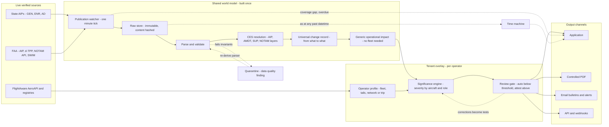

# AeroPub Intelligence — Product Design Plan

| | |
|---|---|
| **Revision** | v1.1 |
| **Date** | 31 August 2026 |
| **Status** | Complete — ready to build |
| **Market** | Airlines + business aviation |
| **Scope** | Complete AIP — GEN, ENR, AD |
| **Data** | Live verified only — no mock |
| **Operation** | 24/7, one-minute heartbeat |
| **Code written** | None yet |

A self-extending analysis platform for the complete aeronautical publication set — AIP, AIRAC
amendments, supplements, AICs, charts and NOTAM — running on live verified sources, with every value
traceable to where it came from, and told in terms of the aircraft an operator actually flies.

---

## 1. Scope and the two modes of use

**Mode A — Entity-driven: "Tell me everything about this."** Select an aerodrome, city pair or route;
receive a complete dossier across GEN, ENR and AD, plus supplements, live NOTAM, AICs, obstacles,
charts, snow plan, and derived suitability, performance and risk assessment.

**Mode B — Publication-driven: "Something was just published, what does it mean?"** An AMDT, SUP,
AIRAC SUP, AIC or NOTAM appears. The watcher detects it within minutes, the platform diffs it, and
produces a ranked operational impact bulletin.

> Mode B is Mode A differentiated over time. **The dossier is the foundation; the bulletin is the
> report.**

## 2. Who it serves — two segments, one engine

| | Scheduled airline | Business & private aviation |
|---|---|---|
| Network shape | Fixed, published schedule | **Ad-hoc** — airports never previously studied, at short notice |
| Who does this today | An AIS/AIM team | **Nobody** — one pilot or a two-person ops desk |
| Binding constraints | Payload, pavement, RFFS, EDTO adequacy, curfews | Runway length, RFFS availability, PPR lead time, customs hours, FBO/fuel, noise curfews |
| Typical aircraft | A320/A321neo, B738, B77W, A359 | Global 7500, G650/G700, Falcon 8X, Challenger 350, Praetor 600, Citation, PC-24 |
| Core question | "What changed this cycle, and what must we action?" | "Can I take *this* aircraft into *that* airport on Thursday?" |

**The Trip object.** Airlines have a persistent `Network`; business aviation has none. The tenant
model needs a lighter entity: a `Trip` (aircraft, date, route, alternates), generated on demand and
expiring afterwards. Same engine, different entry point.

**Commercial read.** Business aviation is likely the faster path to a first paying customer: acute
pain, no incumbent team, short procurement cycles, full coverage from day one on free US data.

## 3. Complete AIP coverage — GEN, ENR and AD

The whole publication, not just AD 2. Several of the most consequential traps live in sections
operators rarely read.

### Part 1 — General (GEN)

| Section | Content | Why it matters |
|---|---|---|
| GEN 0 | Preface, record of amendments, supplements, checklists, contents | **The currency spine.** The AMDT record and SUP checklist are how the system verifies it has seen everything the State published |
| GEN 1 | Designated authorities; entry/transit/departure of aircraft, passengers, cargo; instruments and documents; national regulations; **differences from ICAO** | **GEN 1.7 is the most under-read section in the AIP.** Filed differences are exactly the assumptions that catch crews out. GEN 1.2–1.4 drive overflight and landing permits, customs and quarantine |
| GEN 2 | Units of measurement, abbreviations, chart symbols, location indicators, radio nav aids list, conversion tables, sunrise/sunset | **GEN 2.1 units are an altimetry trap** — hPa vs inHg, feet vs metre flight levels. Sunrise/sunset drives night-operation requirements |
| GEN 3 | AIS, charts, ATS, communication, meteorological and SAR services | MET provision drives alternate minima policy; SAR coverage matters on oceanic and remote routing |
| GEN 4 | Aerodrome/heliport and ANS charges | Trip cost modelling — first-order for charter, tech-stop viability for airlines |

### Part 2 — En-route (ENR)

| Section | Content | Why it matters |
|---|---|---|
| ENR 0 | Preface, amendments, supplements, checklists, contents | Currency verification |
| ENR 1 | General/VFR/IFR rules; airspace classification; holding, approach and departure procedures; radar; **altimeter setting procedures**; ATFM; flight planning; interception | **ENR 1.7 sets Transition Altitude and Level** — varies by State and aerodrome; a mismatch is a direct altimetry hazard. ENR 1.9–1.10 drive flight-plan validity and ATFM exposure |
| ENR 2 | FIR, UIR, TMA and other regulated airspace | Boundary crossings and handover points where procedures change |
| ENR 3 | ATS routes — lower, upper, RNAV, helicopter; en-route holding | Route availability, level bands, directionality. Withdrawal invalidates filed plans |
| ENR 4 | Radio nav aids, special nav systems, GNSS, designators, ground lights | Conventional backup routing; GNSS status feeds RAIM prediction and PBN substitution |
| ENR 5 | Prohibited/restricted/danger areas; military exercise; other dangerous activities; **air navigation obstacles**; aerial sporting; bird migration | Conflict-zone risk; ENR 5.4 feeds the en-route obstacle study; migration corridors feed seasonal hazard profiling |
| ENR 6 | En-route charts | Chart inventory and revision tracking |

### Part 3 — Aerodromes (AD)

| Section | Content | Why it matters |
|---|---|---|
| AD 0 | Preface, amendments, supplements, checklists, contents | Currency verification |
| AD 1 | Availability; **RFFS and snow plan**; index and grouping; **certification status** | AD 1.2 carries the State-level RFFS framework and snow plan, complementing AD 2.7. AD 1.5 certification status is a suitability gate in its own right |
| AD 2 | Aerodromes — full 2.1 to 2.25 per aerodrome | The core dossier — §14 |
| AD 3 | Heliports — equivalent structure | Same treatment where relevant |

**Design consequence.** The GEN 0 / ENR 0 / AD 0 checklists are not boilerplate — they are the audit
mechanism. Each lists exactly which pages and supplements the State considers current. Parsing them
lets the system reconcile what it holds against what the State says exists, and raise a Coverage Gap
for any discrepancy. This is what turns "we scraped their website" into "we can prove we have the
complete, current publication", and it is a prerequisite for `OVERDUE` detection.

## 4. Publication processing — universal first, operator second

Every publication is fully processed and assessed on its own terms, whether or not any customer flies
there. Fleet and network filtering is a layer on top, not a precondition.

### Every publication type, handled as itself

| Type | Nature | Processing |
|---|---|---|
| **AIP (base)** | The standing publication | Parsed in full into attributed facts — the baseline every later layer modifies |
| **AIP AMDT** | Permanent change, non-AIRAC date | Field-level diff against previous state; facts superseded from the stated effective date |
| **AIRAC AMDT** | Permanent change on an AIRAC date | Same, AIRAC-aligned and normally visible 42 days ahead — the lead time the bulletin exists to exploit |
| **AIP SUP** | Temporary change, longer duration | Overlay with explicit validity window; underlying AIP fact preserved beneath |
| **AIRAC SUP** | Temporary change on an AIRAC date | Same, AIRAC-aligned |
| **AIC** | Explanatory/advisory; does not amend the AIP | Classified and linked to entities it discusses. Never overrides a fact — but raises a finding where it signals a coming change |
| **NOTAM** | Immediate temporary change | Top overlay layer, with own validity window and supersession chain |

### Three layers of assessment — and only the third needs a fleet

1. **Change record — universal, factual.** What changed, **from what to what**, in which section,
   effective when, sourced where. Produced for every publication in every State watched, with no
   operator context whatsoever.
2. **Generic operational impact — universal, operator-agnostic.** Why the change matters *in general*:
   which operations it touches, which aircraft characteristics it interacts with, what would need
   recomputing for anyone. Still no fleet, no network, no customer.
3. **Operator assessment — tenant-specific.** Severity for *this* fleet at *this* aerodrome in *this*
   role (§12). May resolve to "no exposure — you do not operate here", and the record beneath it still
   exists in full.

### The change record, as it reads

| Field | From → To | Effective |
|---|---|---|
| AD 2.13 | RWY 34L LDA 3 900 m → 3 500 m | AIRAC 2610 |
| AD 2.13 | RWY 34L ASDA 4 000 m → 3 600 m | AIRAC 2610 |
| AD 2.6 | RFFS category 9 → 7 (0100–0500 UTC) | AIRAC 2610 |
| AD 2.14 | RWY 34L PAPI 3.00° → 3.20° | AIRAC 2610 |

Each line carries its own provenance receipt and its own generic impact statement — *"LDA reduced
400 m: landing distance available is now the shorter of the pair; recompute required landing distance
for any type previously LDA-limited here, and re-check wet and contaminated cases"* — before any
operator profile is applied.

**Why this ordering matters:**

- **Nothing needs backfilling.** When an operator adds a destination, the complete publication history
  is already processed and assessed. No catch-up run, no gap.
- **The AIS lens gets a complete review**, not a filtered one. An AIM team's job is the whole
  publication, not only the parts touching today's network.
- **The product demonstrates without a customer.** A full change record and impact assessment for any
  airport in coverage can be shown before a single fleet is configured.
- **It is a sellable tier on its own.** A baseline "publication review" subscription needs no operator
  onboarding; fleet-filtered severity becomes the upgrade.

## 5. The Consolidated Effective State (CES) engine

Any fact is the product of four layers with their own validity windows and precedence: base **AIP**,
as permanently changed by **AMDT**, as temporarily changed by **SUP**, as immediately changed by
**NOTAM**. Facts are stored bitemporally — `(entity, attribute, value, valid_from, valid_to,
source_ref, precedence)` — and the engine returns the winning value for any datetime with the full
stack beneath it:

| Layer | Value — RWY 34L LDA | Validity |
|---|---|---|
| AIP AD 2.13 | 3 900 m | Base |
| AMDT 09/26 | 3 900 m — unchanged | eff 2610 |
| AIP SUP 14/26 | 3 500 m — THR displaced, WIP | 01 SEP – 30 NOV |
| **NOTAM A2291/26** | **3 100 m — WIP extended** | **12 OCT – 20 OCT ← wins** |

By-products: **supersession chains** and **orphan/conflict detection** (a NOTAM live after its SUP
expired; a SUP never cancelled after the AMDT absorbed it; two sources disagreeing).

## 6. The publication watcher

| Tier | Mechanism | Latency | Applies to |
|---|---|---|---|
| 1 — Push | Streaming feed subscription | Seconds | FAA SWIM, EUROCONTROL NM B2B |
| 2 — Fast poll | REST API, RSS/Atom | 1–5 min | NOTAM APIs, structured feeds |
| 3 — Adaptive poll | Conditional HTTP: `ETag`, `If-Modified-Since`, content hash | 1–15 min | eAIP index pages, AMDT/SUP/AIC listings — tightens to 1 min inside AIRAC publication windows |
| 4 — Scheduled | Rate-limited, robots-aware crawl | Hourly–daily | Heavy PDF portals, rate-limited sites |

Detection is cheap (HEAD request or hash comparison); the full fetch/parse/diff/assess chain only runs
on an actual change. That makes minute-level checking affordable worldwide without getting blocked.

```
WATCHING → CHANGE_DETECTED → FETCHED → PARSED → DIFFED → ASSESSED → IN_REVIEW → PUBLISHED

Exceptions: FETCH_FAILED · PARSE_FAILED · BLOCKED · STALE · OVERDUE
```

**`OVERDUE`** — the AIRAC calendar predicts when each State *should* publish, and the GEN 0 / ENR 0 /
AD 0 checklists say what the State believes is current. If T-42 passes with nothing, or the checklist
lists a supplement we do not hold, that is a finding. Nobody detects the publication that *didn't*
arrive.

## 7. Live sources — and the no-mock-data rule

| Source | Provides | Authority & access |
|---|---|---|
| **FlightAware AeroAPI** | Flight identification, registration, aircraft type, operator, origin/destination, filed route, times | Authoritative for *what is flying*. Official API — usage-priced, free tier |
| **FAA — NOTAM API & SWIM** | US NOTAM, real-time push | Official State source. Free |
| **FAA — AIP, chart supplement, d-TPP** | Full US AIP, complete chart set with per-cycle change list, obstacle data | Official State source. Free, structured |
| **FAA Aircraft Registry** | N-number → type, serial, model, owner | Official registry. Free, bulk download |
| **State AIPs** | GEN, ENR, AD — eAIP XML/HTML, PDF, text, or scanned image | Official State source. Free; terms vary |
| **OEM airport planning manuals** | Payload-range envelopes, ACR/ACN tables, dimensions, turning radii, pavement and jet-blast data | Published openly by manufacturers. Free — basis for §19 |
| OpenSky / ADS-B Exchange | Position and movement data | Community. **Supplement only, never authoritative** |
| OurAirports / OpenAIP | Aerodrome reference data | Community. **Cross-check only** |

**Use the API, not the website.** FlightAware data comes through **AeroAPI**. Scraping
flightaware.com breaches their terms and they actively block it — a scraper would work in development
and fail silently in production, the worst possible failure in this system.

### The no-mock-data rule, as an architectural invariant

- **No synthetic values, ever** — not in the product, not in a demo, not in a screenshot.
- **Tests replay recorded reality.** Real responses captured, content-hashed, version-controlled as
  fixtures. Deterministic and offline without a single invented value; the corpus doubles as the
  parser regression suite.
- **Enforced in the type system.** A `Fact` cannot be constructed without a `SourceRef`.
- **Absence is rendered as absence** — a coverage gap, never a plausible default.

**Recommendation — start with the United States.** FAA gives structured AIP, the complete chart set
with per-cycle change list, real-time NOTAM by push, and a free registry — and because US Government
works are not subject to domestic copyright, it is the one major source where redistribution is
genuinely comfortable.

## 8. Provenance — where every value came from

| SourceRef field | Answers |
|---|---|
| `source_id` | Which State, authority or provider |
| `document` | AIP AD 2.13 / NOTAM A2291/26 / AMDT 09/26 / AeroAPI record |
| `locator` | Exact position — section, page, table cell, XPath |
| `published_at`, `effective_from`, `effective_to` | When issued and when it applies |
| `retrieved_at` | When we read it — so staleness is visible |
| `content_hash` | SHA-256 of the raw artefact |
| `parser_id` + `version` | Which extraction produced it, so a defect traces to every value it touched |
| `confidence` | How certain the extraction is |
| `original_url` + archived copy | The source document, kept immutably so the citation resolves years later |

Every value carries a source affordance opening a **receipt**: *"3 100 m — from NOTAM A2291/26, issued
11 OCT 2026 1420Z, read 11 OCT 1423Z, Item E line 2, extracted by `notam-e-parser v4.2`, confidence
high."* **"Show me the original"** opens the archived document at the exact location. Every report
carries a provenance manifest, including every source that could *not* be read.

**The rule: if it cannot be attributed, it is not displayed.**

## 9. The self-building system

Hand-written parsers are what kills projects like this. The parsing layer builds and repairs itself:

1. **Source discovery.** Seeded from ICAO's State/AIS directory; finds each State's AIP entry point,
   classifies format, locates GEN/ENR/AD parts and AMDT/SUP/AIC indexes, registers detection tier by
   testing what the site supports, learns cadence by observation.
2. **Parser synthesis.** ICAO gives a universal skeleton — GEN, ENR and AD numbered identically
   worldwide, AD 2.1–2.25 included — so one generic eAIP parser covers structured States. For the
   rest, an LLM reads samples and **emits a deterministic parser spec**, which is version-controlled,
   tested and executed deterministically forever after.
3. **Self-healing.** On confidence drop or validation failure, re-derive the spec, replay against
   known-good history, promote only if old answers still come out right. Otherwise quarantine.
4. **Learning loop.** Every human correction becomes a labelled case *and* a regression test.

> **An LLM that writes parsers is safe. An LLM that reads every document live is not.** The first
> produces a deterministic, versioned, testable artefact. The second is non-deterministic per
> document, cannot be regression-tested, and cannot answer "why did it say that?" in an audit.

### The validation harness

- **Internal consistency** — LDA ≤ TORA; ASDA ≥ TORA; TODA ≥ TORA; RFFS 1–10; dimensions in bounds.
- **Geographic sanity** — coordinates inside the State boundary; elevation plausible.
- **Temporal coherence** — effective dates on AIRAC boundaries; validity windows that do not invert.
- **Unit and magnitude** — 39 000 m is a unit error, not a runway; QNH in inHg parsed as hPa is caught.
- **Continuity** — sharp jumps against history held for confirmation.
- **Cross-source agreement** — disagreement is a finding, not a coin toss.

### On the "brain" framing — honestly

The design gives **perception** (watcher + self-repairing parsers), **memory** (bitemporal store that
knows what it knew when), **reasoning** (rules with LLM assistance), and a **feedback loop** that
measurably improves. What it deliberately is *not* is a single neural network producing verdicts end
to end — a black-box verdict without a traceable reason cannot be audited, defended to a regulator, or
sold to an airline.

## 10. Autonomy and the review gate

| Plane | Autonomy |
|---|---|
| **Data plane** — discover, watch, fetch, parse, validate, resolve, diff, assess, draft | **Fully autonomous.** No human in this path |
| **Output plane** — publishing a verdict to an operational consumer | **Gated by severity**, tenant-configurable |

| Severity | Default gate |
|---|---|
| Info, Low | Auto-published, no human |
| Medium | Auto-published with audit sampling |
| High, Critical | One-click human attestation |

**The gate is not a technical limit.** A system with no attestation is buildable; it is not *sellable
to an airline*. A regulator — QCAA, EASA, FAA, or an IOSA auditor — will ask who is accountable for
data feeding an operational decision, and "no one, the system decided" ends the sale. One missed RFFS
downgrade at a sole-suitable EDTO alternate, published unreviewed, is existential for a young company.

The gate costs almost nothing: the system still does the finding, reading, extracting, diffing,
drafting and ranking. **Minutes per cycle, not days.** And it moves — auto-publish threshold rises as
measured accuracy supports it. Fully unattended is a setting, not a rebuild.

## 11. Architecture — ingest once, assess N times

The world model is identical for every customer: an LDA change at LHR is the same fact for every
operator. What differs is *whether it matters to them*. Expensive work is shared, cheap work is
per-tenant, and the marginal cost of customer #2 approaches zero.



Solid lines are the main path; dashed lines are the feedback and exception paths — parser self-healing,
the learning loop, coverage-gap reporting, and the time-machine query against the archive.

```
SHARED WORLD MODEL — built once, self-extending
  0  AIRAC calendar service      28-day spine; predicts when each State should publish
  1  Source registry & discovery self-populating; endpoints, format, cadence, tier, LICENCE
  2  Publication watcher         push + adaptive polling, checklist reconciliation, status model
  3  Ingestion                   eAIP, PDF, scans, charts, NOTAM, AeroAPI, OEM planning manuals
                                 → immutable content-hashed raw store
  4  Parse, validate, normalise  GEN 1-4, ENR 1-6, AD 1-3 incl. AD 2.1-2.25, obstacles, charts,
                                 NOTAM Q-line + Item E → attributed canonical facts
  5  CES resolution & diff       layered precedence, field-level diff, supersession/conflict
     Universal change record + generic operational impact  (§4 layers 1-2)
─────────────────────────── tenant boundary ───────────────────────────
TENANT OVERLAY — per operator, cheap
  6  Significance & competency   Assessment = f(Change, OperatorProfile)  (§4 layer 3)
  7  Review gate                 severity-configurable, every decision logged
  8  Rendering                   6 lenses × 4 formats, white-labelled, provenance-carrying
```

## 12. Operator profile — discovered, not typed

**Automatic onboarding.** Give the system an airline's ICAO code and it discovers the operation from
live data: which **registrations** are flying, what **types** they are, and the **city pairs actually
operated** — including diversion airports a published schedule never shows.

**What live data cannot tell you is capability.** Equipage and approvals — RNP AR, CAT III, CPDLC,
EDTO diversion time — are not observable from a flight track, and inferring them would be exactly the
invented value §7 forbids. Those stay operator-attested.

### AircraftType

| Attribute | Drives |
|---|---|
| ICAO type designator (A21N, A359, B738, B77W, GL7T, GLF6, C68A) | Identity, fleet mapping |
| Aerodrome Reference Code, wingspan, OMGWS, turning radii | Runway/taxiway/apron width, stand compatibility, jet blast |
| ACR / ACN by pavement type and subgrade | PCR / PCN strength checks |
| Approach category (Vat) A–E | Which minima line applies |
| RFFS category required | Aerodrome suitability by role |
| Wake turbulence category (RECAT) | Separation, ATFM |
| Noise certification chapter | Noise restrictions, curfews |
| MTOW, MLW, MZFW, max fuel capacity, payload-range envelope | Payload and range analysis (§19) |
| Reference runway length, certified ceiling | First-pass screening; initial cruise capability |

### Tail-level overrides

RVSM; PBN specs held (RNAV 5, RNAV 1/2, RNP 4, RNP 10, RNP APCH, RNP AR); CPDLC / ADS-C / ADS-B;
CAT II/III and autoland; HUD/EVS; 8.33 kHz; EDTO approval and diversion time; steep-approach approval;
oxygen system configuration (bounding driftdown and depressurisation planning).

## 13. Significance taxonomy

Severity is `f(rule, aircraft, aerodrome role, exposure)`.

| # | Domain | Trigger examples | Downstream impact |
|---|---|---|---|
| 01 | Runway & declared distances | TORA/TODA/ASDA/LDA, displaced THR, slope profile, width | RTOW recompute, chart amendment |
| 02 | Pavement | PCN → PCR transition, strength reduction, surface | ACR/ACN compatibility per type |
| 03 | RFFS | Category downgrade, hours limitation | Aerodrome suitability by role |
| 04 | Instrument procedures | New/withdrawn IAP, minima, LVP, CAT II/III, RNP AR | Crew qualification, chart amendment |
| 05 | NAVAIDs | ILS/DME/VOR/GBAS status, frequency, identifier | Approach availability, PBN substitution |
| 06 | Obstacles | New obstacle in OFZ or departure sector, crane NOTAM, ENR 5.4 | EOSID, OEI net flight path, climb gradient |
| 07 | Lighting | ALS, PAPI/VASI angle, edge/centreline, TDZ, stopbars | Night ops, minima, threshold crossing geometry |
| 08 | Airspace | D/R/P areas, FIR boundary, RVSM, conflict zones | Route validity, contingency |
| 09 | ATS routes | New/withdrawn/redesignated, level restrictions, RAD, CDR/FUA | FPL validity, fuel & EDTO planning |
| 10 | Equipage mandates | CPDLC/ADS-C, PBN specs, transponder, 8.33 kHz | Fleet compliance, tail-level exposure |
| 11 | Availability & access | AD/ATC hours, curfew, PPR, slots, customs, permits | Dispatch, trip viability |
| 12 | Winter & surface condition | Snow plan, GRF/RWYCC, SNOWTAM, de-icing, friction reporting | Landing performance, seasonal readiness |
| 13 | Hazards | Bird/wildlife and migration, ASHTAM, laser, GNSS jamming | Risk register, NOTAM triage |
| 14 | Aerodrome categorisation | Terrain, special procedures, steep approach | Cat A/B/C, crew qualification |
| 15 | **Altimetry & vertical reference** | TA/TL changes, metric flight levels, QNH unit conventions, cold-temperature corrections | Level bust and terrain clearance risk |
| 16 | **State differences from ICAO** | GEN 1.7 differences — new, amended or withdrawn | Procedural assumptions that no longer hold |

### The same change, two operators

| Change | Operator A — B77W/A359, EDTO alternate | Operator B — A320 fleet, occasional destination |
|---|---|---|
| RFFS Cat 9 → Cat 7 | **CRITICAL** — below required Cat 9, alternate invalid | INFO — A320 requires Cat 6 |
| PCR/PCN reduced | **HIGH** — A359 ACR now exceeds published | LOW — ample margin |
| Taxiway restricted to Code D | **HIGH** — no compliant routing to stand | INFO |
| New crane, departure sector RWY 16 | **CRITICAL** — EOSID review, climb gradient | **HIGH** — gradient check required |
| RNP AR APCH withdrawn, terrain-limited | **HIGH** — AR-approved, in use | **CRITICAL** — was the only usable procedure |
| Transition Level convention changed | MEDIUM — briefing and OM-C amendment | MEDIUM |
| Declared distance −400 m | **HIGH** — RTOW recompute both types | MEDIUM |

**Live transition:** States are converting ACN/PCN → **ACR/PCR** at different rates. The pavement rule
must evaluate both concurrently for years and flag internal inconsistency during changeover.

## 14. Route and aerodrome competency method

The analytical workflow the platform automates — with an honest split of what it does end to end, what
it prepares, and what stays with an engineer.

### Phase 1 — En-route

| Workstream | Covers | Automation |
|---|---|---|
| **Terrain profile & driftdown** | Route against Grid MORA and MEA; points of no return; engine-out driftdown escape routes; oxygen and depressurisation strategy | **Prepared** — system assembles terrain profile, MORA/MEA bands and candidate corridors; engineer computes and approves the path |
| **Airspace & regulatory** | FIR transitions; State differences from ICAO (GEN 1.7); TA/TL validation across jurisdictions | **Automated** |
| **PBN & navigation audit** | Required nav spec per airspace (RNAV 5, RNP 4, RNP 10); RAIM prediction for the operating window; ground navaid dependencies for conventional reversion | **Automated** |
| **Communications & ATC** | High-density or complex ATC environments; VHF coverage gaps requiring HF or CPDLC logon | **Automated** |

### Phase 2 — Aerodrome

| Workstream | Covers | Automation |
|---|---|---|
| **Physical & geometry** (AD 2.12) | Dimensions, slope profile including undulating gradients, surface and friction; PCN/PCR vs ACN/ACR at max weights | **Automated** |
| **Declared distances & performance** (AD 2.13) | TORA/TODA/ASDA/LDA; temporary shortenings and displaced thresholds; aerodrome reference temperature effects | **Prepared** — constraints and deltas automated; certified weight computation stays in the operator's tool |
| **Terminal procedures** (AD 2.22, charts) | SIDs/STARs screened for energy-management traps; approach charts for FAF crossing altitudes, missed approach geometry, ALS cues | **Prepared** — parameters extracted and screened; judgement on trap severity reviewed |
| **Local regulations & environment** (AD 2.20–2.21) | Night curfews, slots, NADPs; documented hot spots; mandatory tug or non-standard pushback | **Automated** |

### Phase 3 — Threat and contingency

| Workstream | Covers | Automation |
|---|---|---|
| **Special EOSID** | Where standard SIDs or missed approaches do not give adequate terrain clearance after engine failure | **Engineer** — system flags *when* one is needed and assembles the obstacle set; designing it is certified work |
| **Diversion & alternate viability** | Alternates on physical capability — runway length, RFFS, ramp space — not weather alone; critical fuel scenario for missed approach then gear-extended or depressurised diversion to the furthest alternate | **Prepared** — physical screening automated; fuel scenario needs operator performance data |
| **Climatology profile** | Seasonal met profile; mountain wave and convective windshear, severe icing, typhoon and monsoon exposure, extreme cold altimeter correction | **Automated** |
| **Threat matrix consolidation** | Executive briefing pack: threats visualised, non-standard phraseology highlighted, operational game plan | **Automated** — the crew threat brief lens |

**Why the honest split matters.** Ten of twelve workstreams the platform carries end to end or to a
reviewed draft. Two — driftdown path design and special EOSID engineering — remain certified
engineering work, and the product should say so plainly. What it does for those two is **detect that
they are needed and assemble every input**, which is most of the elapsed time in practice.
Overclaiming here is how a supplier loses a technical evaluation.

## 15. The complete aerodrome dossier — AD 2.1 to 2.25

| AD 2 | Content | Derived analysis |
|---|---|---|
| 2.1–2.2 | Location indicator and name; geographical and administrative data | Reference point, elevation, magnetic variation currency |
| 2.3 | Operational hours — ATC, customs, fuelling, security | Curfew, PPR lead time, slot exposure vs schedule or trip |
| 2.4 | Handling services — cargo, fuel types, de-icing, hangar space | Fuel type and uplift; de-icing capacity vs fleet and season; hangar availability for a Trip |
| 2.5 | Passenger facilities | Diversion support capability; crew rest logistics for a Trip |
| 2.6 | Rescue and fire fighting — category, equipment, **agent depletion limits** | **Category held vs required per type**, by role, incl. on-request availability, downgrade hours, and whether depletion limits constrain repeated operations |
| 2.7 | **Seasonal availability and clearing** — snow, ice and slush removal, friction and **braking action measurement** | Clearance priority, GRF/RWYCC readiness, SNOWTAM history, winter risk rating |
| 2.8 | Aprons, taxiways, check locations | **Stand and taxi-route compatibility** by wingspan, OMGWS, turning radii, jet blast, pushback; Code E/F routing |
| 2.9 | Surface movement guidance and control system, markings — signs, lines, stop bars | Low-visibility taxi capability; stop-bar provision as an incursion defence; incursion risk points |
| 2.10 | Aerodrome obstacles — Areas 2 and 3 | Full obstacle study (§16) |
| 2.11 | Meteorological information — associated MET office, briefing hours, TAF and METAR provision | Observation and forecast type vs alternate minima policy; whether a TAF exists at all is itself an alternate-eligibility gate |
| 2.12 | Runway physical characteristics — dimensions, slope profile, composition, PCN, threshold locations, arrestor beds | Slope effects on brake energy and hydroplaning; pavement margin at max weights |
| 2.13 | Declared distances | Deltas vs last cycle; payload-driver flags; displaced threshold impact |
| 2.14 | Approach and runway lighting | Minima dependencies; **PAPI angle vs wheel-to-threshold clearance** for widebody geometry |
| 2.15 | Other lighting, secondary power | Switch-over time against low-visibility requirements |
| 2.16 | Helicopter landing area | Where applicable |
| 2.17 | ATS airspace | Class, boundaries, entry requirements vs equipage |
| 2.18 | ATS communication facilities — frequencies, call signs, SATVOICE, datalink logon | Frequency and hours coverage gaps; CPDLC logon address changes affect datalink-mandated airspace |
| 2.19 | Radio navigation and landing aids | Navaid availability vs approaches flown; PBN substitution |
| 2.20 | Local aerodrome regulations | Hot spots, mandatory tug or pushback, training restrictions |
| 2.21 | Noise abatement — curfews, continuous descent, thrust reduction heights | **NADP 1 vs NADP 2 applicability** — the two profiles set different thrust-reduction and flap-retraction heights, changing both noise footprint and engine thermal exposure; runway restrictions; CDO requirements |
| 2.22 | Flight procedures — SIDs, STARs, missed approach | Energy-management screening; EOSID requirement flag |
| 2.23 | Additional information — bird hazard patterns, laser radiation warnings, seasonal anomalies | Seasonal hazard profile; laser exposure zones carried into the crew threat brief |
| 2.24 | Charts related to the aerodrome | Full chart study (§17) |
| 2.25 | **State-specific / miscellaneous** — regional geodetic rules, specific security measures, localised environmental protocols | Parsed where present; content varies by State, so a prime candidate for the free-text path |

**Derived output:** suitability matrix (type × role, traffic-lighted, each cell traceable to the
constraint that set it) · risk register · Cat A/B/C recommendation with written justification ·
payload-driver summary · change log since last signed dossier.

## 16. Obstacle studies

| Source | Content |
|---|---|
| AIP AD 2.10 | Aerodrome obstacles in Areas 2 and 3, by runway |
| AIP ENR 5.4 | Air navigation obstacles — enroute and area |
| Obstacle Chart Type A | Take-off obstacles per runway against declared distances |
| eTOD Areas 1–4 | Electronic terrain and obstacle data where published |
| **NOTAM** | **Temporary obstacles — cranes above all.** The most common cause of a departure procedure changing between cycles |

**Produces:** per-runway inventory with cycle delta · departure sector analysis incl. close-in
obstacles affecting climb gradient · OLS penetration list · EOSID relevance flag · missed-approach
obstacle analysis · crane NOTAM tracking on the same validity timeline.

> *"New obstacle within the departure sector of RWY 16 — 412 ft AGL at 2.1 NM, NOTAM'd today, valid
> 90 days. Affects climb gradient for GL7T, B77W, A359. EOSID review required before next
> departure."* Delivered within minutes, with the NOTAM one click away.

## 17. Chart studies

| Chart type | Tracked and extracted |
|---|---|
| **IAP** (ILS, RNP, RNAV, VOR, NDB, visual, circling) | DA/MDA and RVR minima per approach category, required equipment and approvals, FAF crossing altitude, missed approach geometry and gradient, notes, cold-temperature corrections |
| **SID** | Required climb gradients, obstacle notes, initial routing and level restrictions, engine-out relevance, noise constraints |
| **STAR** | Transitions, speed and level windows, routing, holding — screened for energy traps |
| **Aerodrome diagram** | Runway and taxiway layout, **hot spots**, stand numbering, restricted taxiways |
| **Terminal area chart** | Terminal airspace structure, entry/exit points, sector boundaries |
| **ATC / radar minimum altitude (MVA/MRVA)** | Radar vectoring altitudes by sector — the safety net behind every vector |
| **Obstacle chart Type A** | Take-off obstacle data feeding §16 |
| **En-route charts (ENR 6)** | Route structure, MEA/MORA bands, reporting points — feeding the terrain profile |
| **ODP / textual departures, noise charts** | Alternative departure requirements and noise procedures |

**Analysis:** chart revision tracking, including charts *expected* to change from a detected AIP change
(if the plate does not follow, that is a discrepancy) · minima delta per approach category · capability
matching against tail-level capability · gradient screening · energy-management screening · hot spot
inventory.

**Why FAA-first matters:** the FAA publishes the complete US terminal procedure set (d-TPP) free every
28 days *with an explicit list of which charts changed*. That turns chart change detection from a
computer-vision problem into reading a change file.

## 18. NOTAM analysis

**Stage one is deterministic:** parse the Q-line — FIR, Q-code subject/condition pair, traffic,
purpose, scope, level band, coordinates and radius — plus Items A–G including the D-item schedule.

**Stage two handles Item E**, the free text where the operational meaning of a large share of NOTAM
lives. Rules and pattern extraction first, LLM assistance second — never to suppress a rule hit.

On top: **fleet and network filtering** · **overlay onto the effective state** · **supersession and
duplication** resolved · **persistence detection** (a "temporary" NOTAM reissued for eighteen months
is a permanent condition the State has not published properly) · **special formats** — SNOWTAM,
ASHTAM, GNSS jamming and interference.

## 19. Performance, payload and fleet segments

**Revised position.** The earlier blanket "no performance work" boundary was too conservative. Three
tiers with very different licence and liability profiles:

| Tier | What it is | Position |
|---|---|---|
| **1 — Constraint identification** | Which factors limit payload here, how each moved, what must be recomputed | **In scope.** No licence issue |
| **2 — Envelope analysis** | Payload-range interpretation, structural weight relationships, pavement compatibility, geometric fit — from **OEM airport planning manuals, published openly** | **In scope.** Published data, published for exactly this purpose |
| **3 — Certified computation** | RTOW, V-speeds, second-segment climb, brake energy, contaminated landing distance | **Operator's tool.** Requires AFM data and an approved application |

### Payload-range envelope zones

| Zone | Limited by | What a route change costs |
|---|---|---|
| **Structural** | MZFW — maximum payload, range growing until MTOW is reached | Extra distance nearly free until the MTOW corner |
| **MTOW trade** | MTOW — every kg of fuel added costs a kg of payload | **A one-for-one trade.** Longer routing, further alternate or higher reserve comes straight out of payload |
| **Volumetric** | Maximum fuel capacity reached — range extends only by removing weight | Payload falls steeply for small range gains; usually the signal to consider a tech stop |

MLW constrains the arrival end independently, and a distant alternate can make landing weight rather
than takeoff weight the binding limit — a case operators routinely discover late.

### Fleet segment characteristics

Qualitative profile attributes that shape interpretation, not computed numbers:

| Segment | Characteristics that change the analysis |
|---|---|
| **Airbus commercial** (A321neo, A350-900) | Fly-by-wire with hard envelope protection; high-lift wing behaviour hot-and-high; Brake-to-Vacate on the A350 changes runway occupancy and exit planning. Narrowbody neo range growth pushes thin long routes into the MTOW trade zone |
| **Boeing commercial** (B737-800, B777-300ER) | Pilot-overridable envelope protection on the 777; conventional control with manual reversion on the 737NG; very high thrust on the GE90-powered 777-300ER gives second-segment climb margin that matters at obstacle-limited and hot-and-high fields; carbon brake energy on high-capacity operations |
| **Business & private jets** (Global 7500, G700, Falcon 8X) | High thrust-to-weight allowing direct climb to high initial cruise levels; low Vref and genuine short-field capability opening airports airliners cannot use; certified ceilings above the airway structure changing route and driftdown analysis; RFFS category often the binding constraint rather than runway length |

**Bring your own performance data — the Tier 3 bridge.** Where an operator uploads their own RTOW
tables — held under *their* licence, in *their* tenant — the platform computes actual weight and
payload deltas and closes the loop on the critical-fuel scenario. We never hold OEM AFM data; the
capability arrives with the customer.

## 20. Route dossiers

| Element | Content |
|---|---|
| Terrain & vertical profile | Route against Grid MORA and MEA; high-terrain segments; points of no return; driftdown escape corridors and depressurisation strategy |
| ATS routing | Available routes, level bands, flow direction, RAD restrictions, CDR and FUA availability |
| Airspace crossed | FIRs and sectors, D/R/P areas, conflict-zone advisories, overflight and diplomatic clearance requirements and lead times |
| Altimetry | TA/TL by jurisdiction, metric level systems, QNH unit conventions, cold-temperature corrections |
| Departure | SIDs, NADP applicability, obstacle environment, EOSID relevance, departure payload drivers |
| EDTO / ETOPS | Adequate aerodromes along track, diversion time circles, alternate weather minima, RFFS and hours at each |
| Comms & navigation | HF/CPDLC/SATCOM coverage, surveillance requirements, PBN spec per airspace vs tail capability, RAIM prediction |
| Arrival | STARs screened for energy traps, approaches with minima and required approvals, destination and alternates with suitability roll-up |
| Payload & fuel | Route length against the published payload-range envelope, constraint stack, critical fuel scenario inputs, tech-stop viability |
| Risk assessment | Consolidated route risk with mitigations, and every open item requiring a decision before operating |

**Private charter variant.** For a Trip, the dossier adds customs and immigration availability and lead
time, overflight and landing permits with lead times, PPR and slot requirements, FBO and handling
hours, fuel availability and payment method, noise curfews, crew duty and rest logistics, ground
transport, and published charges (GEN 4).

## 21. Six output lenses

| Lens | Audience | Content | Format |
|---|---|---|---|
| **Threat brief** | Flight crew | Consolidated threat matrix: runway in use, expected approach and minima, terrain and obstacles, hot spots, energy traps on arrival, non-standard phraseology, WIP, LVP status, bird activity, RFFS | 1–2 pages, EFB-ready |
| **Aerodrome study** | Ops engineering | The §15 dossier following §14 Phase 2: all AD 2 sections, suitability matrix, obstacle and pavement analysis, risk register, categorisation justification | Controlled document |
| **Route study** | Network & ops eng | The §20 dossier following §14 Phases 1 and 3: terrain and driftdown, airspace, PBN and RAIM audit, EDTO adequacy, altimetry, payload drivers, route risk | Study document with terrain profiles |
| **Airspace & flight plan** | ATS / ATM | Route availability and level restrictions, RAD and CDR changes, ATFM exposure, radar minimum altitudes, transition levels — and whether the filed plan will validate | Change list + FPL validity flags |
| **Operational digest** | Dispatch / OCC | Time-bounded and per-flight: suitability today, fleet-filtered NOTAM digest, alternate selection, curfew and slot exposure, closures affecting this rotation, payload impact | Live view + per-flight package |
| **Cycle worklist** | AIS / AIM team | Watcher dashboard: who published what and when, checklist reconciliation, coverage, overdue publications, full diff, supersession register, data-quality conflicts, attestation queue | Live status board + audit trail |

## 22. Content boundaries

Commercial chart content (Jeppesen, Lido, NAVBLUE) cannot be redistributed. For those sources the
platform tracks inventory, revision state and extracted parameters, and deep-links into the customer's
own chart viewer under their existing licence. **Chart analysis is ours; chart images are theirs.**
Where the State publishes charts freely — the FAA above all — the charts travel with the product. The
same principle governs AIP text and commercial flight data: AeroAPI content drives the analysis rather
than being republished.

## 23. Output design principles

| Principle | In the output |
|---|---|
| **Delta first** | Every document opens with what changed since the last signed version |
| **"So what" on every line** | No finding without a consequence, required action, named owner and deadline |
| **Validity timeline** | A time bar showing what is in force when — SUP windows, NOTAM overlays, AMDT effective dates, crane validity |
| **Provenance on every line** | Source, locator, dates, hash, parser version, confidence — one click from any value |
| **Coverage gaps in red** | A failed source produces a visible gap entry, never a blank |
| **Volatility flag** | "14 significant changes in 6 cycles" marks an unstable aerodrome |
| **Comparative view** | This alternate against the operator's other alternates in the region |
| **What-if** | "If RWY 34L closes, can I still dispatch?" |
| **Machine-readable alongside** | Every report also emitted as JSON/XML, provenance included |

## 24. Deployment and output channels

Two independent axes. Where the system runs is one decision; how the analysis reaches a person or
another system is a different one.

### Axis 1 — where it runs

| Deployment | Form | Fits |
|---|---|---|
| **Hosted** | Web application, SSO, always current, live NOTAM and watcher status | Operators comfortable with cloud |
| **Offline cycle package** | **A single self-contained file per AIRAC cycle. Opens in any browser. Fully offline. No install, no runtime, no admin rights.** Signed and checksummed, provenance embedded | Locked-down IT |
| **On-premise** | Container inside the operator's own network | Strict security postures, data residency |

### Axis 2 — how the output reaches its consumer

| Channel | What it is | Primary consumer |
|---|---|---|
| **In-application** | Interactive dossier browser, change-record explorer, watcher status board, attestation queue, search across every fact | AIS/AIM team, ops engineering |
| **Print & document** | Controlled PDF with a real document-control block, built for signing and filing | Document control, compliance, auditors, crews |
| **Email** | Scheduled cycle bulletins and immediate severity alerts, routed per role | Dispatch, OCC, management — people who will not log in daily |
| **API & webhooks** | JSON over REST, plus push events — §25 | The operator's own systems |

### Print — a first-class output, not a browser print

These documents go into Operations Manuals, get signed, get filed, and get handed to auditors years
later. That demands a purpose-built print treatment:

- **Document control block** on the cover — operator's own document number, title, aerodrome or route
  identifier, revision number and date, AIRAC cycle, effective date and next review date, distribution
  and classification, and **prepared by / reviewed by / approved by** with dates and signature space.
- **Record of amendments page**, so the document carries its own revision history in the format a
  manual system expects.
- **Table of contents with page numbers**, running headers and footers carrying the aerodrome
  identifier, revision and **page X of Y** on every page.
- **Provenance appendix** — every source consulted with citation, retrieval time and hash, and every
  source that could not be read.
- **Typographic and pagination discipline** — table headers repeat across page breaks, rows and figures
  never split mid-record, orphan and widow control, and a **DRAFT watermark** until attested.
- **PDF/A output** for archival retention, alongside standard PDF for circulation.
- **White-labelled** — operator branding, their manual section numbering, their severity vocabulary and
  language, so it drops into their existing manual without re-editing.

### Email — for the people who will never log in

| Trigger | Content | Timing |
|---|---|---|
| Cycle bulletin | Ranked operational impact for the coming AIRAC cycle | Configurable, default T-21 |
| Severity alert | A single Critical or High finding, with action and owner | Immediately on attestation |
| NOTAM digest | Fleet-filtered NOTAM for the network or a rotation | Daily or per-shift |
| Watcher exception | Coverage gap, or a State's publication now `OVERDUE` | On detection |
| Study issued | An aerodrome or route study revised and re-approved | On approval |

Routing is per recipient and per role: crews get the threat brief, dispatch gets the operational
digest, the AIM team gets the worklist, and each recipient sets their own severity threshold. Findings
are batched into digests, so a heavy cycle produces one useful email instead of four hundred.

**Build for the mail client airlines actually use.** Airline desktops are Outlook-heavy, and Outlook
ignores much of modern CSS. Email templates are **table-based, inline-styled, single-column, around
600 px wide, with a plain-text alternative** — no flexbox, no grid, no web fonts. Every email
deep-links back into the application. Deliverability needs a dedicated sending domain with SPF, DKIM
and DMARC aligned from the start; retrofitting that after messages start landing in junk is painful.

## 25. API and integration

Where a customer wants the analysis inside their own systems rather than ours.

### Design rules

- **Every object carries its provenance.** A `source_ref` block travels with each value in every
  response, exactly as in the UI. An integration that strips it is the customer's choice; the API
  never omits it.
- **Versioned and stable.** `/v1/` in the path; additive changes only within a version; deprecation
  announced a minimum of two AIRAC cycles ahead, so integrators plan against the same calendar the
  data uses.
- **Licence filtering applies here too.** The `redistribution` field on each source governs API
  responses exactly as it governs the offline package — assessments and citations always, source text
  only where licensed.
- **Time is a first-class parameter.** Almost every read accepts `?at=<datetime>`, because the CES
  engine's whole point is answering "what was true then".

### Core endpoints

| Endpoint | Returns |
|---|---|
| `GET /v1/aerodromes/{icao}?at=` | Consolidated effective state — every AD 2 fact resolved for that instant, each with its source stack |
| `GET /v1/aerodromes/{icao}/changes` | Universal change record between two cycles or dates — from what, to what, which section, effective when |
| `GET /v1/aerodromes/{icao}/obstacles` | Obstacle inventory including live temporary obstacles, with cycle delta |
| `GET /v1/aerodromes/{icao}/charts` | Chart inventory, revision state, extracted minima and gradients |
| `GET /v1/publications` | Publication register — filter by State, type (AMDT / AIRAC AMDT / SUP / AIRAC SUP / AIC), cycle, detection time |
| `GET /v1/publications/{id}` | One publication with its full change record and generic operational impact |
| `GET /v1/assessments` | Operator-filtered findings — by severity, aerodrome, cycle, ops domain, attestation state |
| `GET /v1/notams` | Fleet-filtered NOTAM, decoded, with supersession resolved |
| `GET /v1/routes/{dep}/{dest}` | Route dossier content — airspace, ATS routes, EDTO adequacy, altimetry, alternates |
| `GET /v1/watcher/status` | Source health, last check and publication, coverage gaps, overdue States |
| `GET/PUT /v1/fleet`, `/v1/network` | Operator profile — read and maintain fleet, tails and network roles programmatically |
| `POST /v1/trips` | Submit an ad-hoc trip and receive its complete dossier — the business-aviation entry point |

### Webhooks — push, not just pull

Polling an API for a NOTAM that appeared four minutes ago defeats the point of the watcher.

| Event | Fires when |
|---|---|
| `publication.detected` | A new AMDT, SUP, AIC or base AIP revision is seen |
| `change.recorded` | A universal change record is produced for a publication |
| `finding.published` | An assessment clears the review gate — filterable by severity |
| `notam.relevant` | A NOTAM matching the operator's fleet and network appears |
| `coverage.gap` | A source failed and the gap affects the operator's network |
| `publication.overdue` | A State has not published by its predicted deadline |

Payloads are HMAC-signed, delivery retries with exponential backoff, and a replay endpoint lets an
integrator recover events missed during their own outage — which matters when the consuming system is
operational.

### Formats and integration surface

| Format | Use |
|---|---|
| **JSON** | The default. Pragmatic, and what most integrations actually want |
| **NDJSON streaming** | Whole-cycle bulk pulls without pagination pain |
| **AIXM 5.1** | For systems that already speak the ICAO/EUROCONTROL exchange model — an AIS or flight-planning system can ingest it without a custom mapping |
| **XLSX / CSV** | For the analyst who will work the change record in a spreadsheet, which is a real workflow |
| **PDF / PDF/A** | Programmatic generation of the controlled documents in §24 |

Likely integration targets: flight-planning systems, EFB document libraries, operations manual and
document-control systems, safety and SMS reporting tools, and OCC dashboards. The API is designed so a
finding can be pushed into a customer's existing safety register or manual amendment workflow rather
than becoming another portal someone has to remember to check.

**Sandbox — real data, consistent with the no-mock rule.** A published OpenAPI specification lets
integrators generate clients, and a sandbox exercises every endpoint against **genuine live FAA data
for a real public aerodrome** — not fabricated test fixtures. The no-mock rule is not suspended for
developer convenience, and an integrator building against the sandbox is building against exactly the
shapes production returns.

## 26. Running 24/7

An always-on cloud service with a one-minute heartbeat. What varies per source is the cadence, not
whether the system is watching.

### The minute tick

Every 60 seconds the scheduler wakes and does the same seven things. This is the system's clock, and
it never stops:

1. **Drain the push queues.** Anything waiting from FAA SWIM or EUROCONTROL NM B2B is consumed
   immediately. These are subscriptions, not polls — NOTAM arrives in seconds, not minutes.
2. **Select the due set.** Every source carries a next-check time. The tick collects those now due — a
   mix determined by detection tier, proximity to the AIRAC publication window, and each source's
   observed behaviour.
3. **Issue conditional requests.** `HEAD`, `ETag`, `If-Modified-Since`, or a content hash. A few
   kilobytes per source; nothing is downloaded unless something moved.
4. **Enqueue what changed.** Changed sources go to the heavy pipeline — fetch, archive, parse,
   validate, resolve, diff, assess. Unchanged sources cost almost nothing and are rescheduled.
5. **Recompute cadence.** Next-check times set from tier, AIRAC proximity and observed publication
   history. Inside a publication window a State's index page tightens toward every minute; in the quiet
   middle of a cycle it relaxes.
6. **Check for what did not arrive.** `OVERDUE` evaluation against the AIRAC calendar and the State's
   own GEN 0 / ENR 0 / AD 0 checklists.
7. **Update the status board.** Every source's state, freshness and coverage gaps refreshed — the live
   view behind the AIS lens and the `/v1/watcher/status` endpoint.

### Scale — and why minute cadence is affordable

Roughly 180 States × several endpoints each (AIP, AMDT, SUP and AIC indexes, NOTAM) gives on the order
of **a thousand to fifteen hundred watched sources**, plus per-aerodrome NOTAM queries. Checking all of
them every minute is around 25 requests per second of small conditional traffic — technically
unremarkable.

**The real constraint is not our capacity.** It is the States' servers. Hammering a national AIS
website every 60 seconds is how an IP address gets blocked, and a blocked source is a *silent* coverage
gap — the worst failure this system has. So the heartbeat stays at one minute and the **per-source
cadence adapts**: real-time on push feeds, minute-level on APIs and sources that tolerate it, adaptive
on eAIP index pages, deliberately slower on fragile PDF portals. Every source is watched continuously;
not every source is asked the same question at the same rate.

### Runtime shape

- **Scheduler with leader election**, so exactly one tick fires even across a rolling deploy or node
  failure.
- **Durable queue between detection and processing**, so a slow parse never delays the next tick.
- **Two worker pools.** Detection workers are high-concurrency and near-idle on CPU; parse workers are
  few, memory-hungry, and handle PDF and OCR. Separating them stops a 400-page scanned AIP from
  starving NOTAM ingestion.
- **Per-host token buckets and circuit breakers** — politeness enforced in code, and a failing source
  backs off instead of being retried into a block.
- **Idempotent jobs** keyed by `(source_id, content_hash)`, so restarts, duplicate deliveries and
  replays are all safe.

**The load is spiky, and that shapes the infrastructure.** Aeronautical publication is not a steady
stream — it clusters hard around AIRAC dates, then little happens for weeks. The processing tier
therefore needs to **autoscale for the AIRAC surge** and scale back down between cycles. Sizing for the
average would miss cycle days; sizing for the peak permanently would be several times the necessary
cost.

### Never missing a publication

- **Catch-up on restart, not just resume.** After any outage the system compares each source's current
  state against the last known hash rather than continuing from where the queue stopped — so a two-hour
  gap is detected and closed, not skipped.
- **Cycle-close reconciliation.** At the end of every AIRAC cycle the system reconciles what it holds
  against each State's published checklist. Anything missing becomes a finding.
- **Replay from the raw store.** The immutable archive means the whole pipeline can be re-run without
  re-fetching a single source — essential when a parser defect is found and every value it touched must
  be recomputed.

### Monitoring the monitor

A watcher that stops watching, silently, is worse than no watcher. The platform is itself monitored
from outside: a **dead-man's switch** alerts if the tick stops, and per-source freshness, queue depth,
parse failure rate and quarantine rate are all tracked.

| Service level | Target |
|---|---|
| **Time from State publication to customer notification** | The headline metric — measured, trended, reported |
| NOTAM detection — push sources | Under 60 seconds |
| NOTAM detection — polled sources | Under 5 minutes |
| AIRAC publication detection, in window | Under 15 minutes |
| Read availability (UI and API) | 99.9% |
| Detection continuity | **Independent of read availability** — ingestion keeps running even when the interface is down, because a missed publication cannot be recovered by an apology |

### The cost shape — and why it reinforces the commercial model

Running 24/7 is a **fixed platform cost, not a per-customer one**. Detection is negligible; parsing is
modest and spiky; parser synthesis is one-off per source; the growing line is the immutable raw
archive, which object storage with lifecycle tiering handles cheaply. Because the world model is built
once and assessed per tenant, **the second customer adds almost nothing to this bill** — which is
precisely what makes the continuous-operation requirement commercially viable rather than ruinous.

## 27. Intelligence roadmap

What else the platform can answer once the archive exists. The most valuable additions are not new
data — they are questions only this dataset can answer.

| Capability | What it does | Effort | Value |
|---|---|---|---|
| **Time machine** | The complete published state at any past instant, with citations | **Near-zero** | **Very high** |
| **Opportunity findings** | Constraints that *lifted*, not only those that tightened | **Near-zero** | High |
| **Works programme tracking** | Cluster scattered messages into one tracked construction project | Medium | **Very high** |
| Mandate roadmap | Forward view of equipage mandates across the network vs tail capability | Low-med | High |
| Alternate portfolio optimisation | Rank and stress-test the alternate set; surface concentration risk | Medium | High |
| State publication quality index | Which States publish late, contradict themselves, or misuse NOTAM | Low | Medium — *and a second market* |
| Cross-source contradiction | AIP, chart and NOTAM disagreeing on the same fact | Low-med | High |
| GNSS interference & conflict zones | Jamming, spoofing and airspace-closure NOTAM as a geographic time series | Med-high | High, and topical |

### Recommended first — the time machine

Not a new feature. It is the bitemporal model (§5) queried a different way: every `Fact` already carries
`valid_from`, `valid_to` and a `SourceRef` with an archived copy of the original. Exposing "as at
`<datetime>`" is a query layer and a date picker, and the API already specifies `?at=` on almost every
read (§25).

What it answers that nothing on the market can:

- **Safety investigation.** An event happens. What was actually published that day — the AIP, the SUP in
  force, the live NOTAM, the chart revision? Reconstructing that today takes weeks of correspondence
  with AIS departments and often fails, because State archives are patchy and superseded NOTAM simply
  disappear.
- **Audit and regulatory defence.** Prove what was knowable and when, with a content hash and an
  archived source document.
- **Insurance and dispute.** The same question, higher stakes.
- **Internal quality assurance.** What did the dossier say at the time, and did we action the change?

**The one thing that must be right from the first commit.** This capability depends entirely on
**archive completeness discipline**: the raw store is never pruned, and superseded NOTAM are retained
after the State drops them. That is a standing storage cost and a policy decision, and it cannot be
applied retroactively — **an archive not kept cannot be recovered**. Deciding later to save storage by
pruning permanently destroys the capability. Object storage with lifecycle tiering makes the cost
modest; the discipline is what matters.

**Why it is also the strongest commercial move.** It converts the immutable raw archive from a growing
cost line (§26) into the product's most defensible asset. Every cycle that passes widens the moat,
because a competitor *cannot retroactively acquire* documents that States have already replaced. It is
also the best demonstration in the product: pick any aerodrome, pick any past date, show the complete
state with citations. A live-only system cannot answer the question at all.

### Runner-up — works programme tracking

The only item on this list that is a genuinely new capability rather than a repackaging of existing
data.

A runway rehabilitation generates a SUP, forty NOTAMs, six extensions, three chart revisions and an
eventual AMDT, spread across eighteen months. Every system on the market presents those as forty-nine
unrelated messages. Clustering them into a single `WorksProgramme` entity transforms the signal-to-noise
ratio:

| Aspect | Detail |
|---|---|
| Clustering signals | Same aerodrome and facility, overlapping validity windows, textual similarity in Item E, explicit cross-references between NOTAM and SUP, and the supersession chains already resolved in §5 |
| Attributes tracked | Scope, affected runways and taxiways, start, stated end, extension count, slip history, current state, and an empirical completion estimate |
| The useful output | *"RWY 16/34 rehabilitation — stated end date has moved four times, averaging six weeks each; empirical estimate is 11 weeks beyond the current published date."* |
| Hard part | Entity resolution across free text, in multiple languages — this is where the effort sits |
| Secondary value | Seasonal planning: a runway constrained through an entire winter is visible as one fact rather than inferred from message volume |

### The cheap win — opportunity findings

The same rules engine (§13), evaluated for improvement rather than only degradation: a threshold
restored, declared distance returned to full length, RFFS category upgraded, a procedure reinstated, a
navaid returned to service, a taxiway reopened, a curfew relaxed, or a new approach published with
lower minima.

These need their own finding class rather than being filed as Info, where they would be lost in routine
noise. Two reasons it repays the near-zero effort:

- **It is money.** A restored declared distance can mean tonnes of payload on a route that has been
  planned around the restriction for months. Nobody currently tells an operator when a constraint lifts
  — they discover it eventually, or never.
- **It changes how the tool is regarded.** A system that only ever brings bad news gets ignored. One
  that occasionally says "you can now carry more into this field" gets opened.

### Recorded backlog

| Capability | Detail |
|---|---|
| **Mandate roadmap** | Aggregate equipage mandates from GEN and ENR across the whole network and project them against tail-level capability: *"by January 2027, twelve tails cannot enter these four FIRs."* Uses data already parsed and a profile already built |
| **Alternate portfolio optimisation** | Rank the alternate set on real capability, not habit — suitability, distance, RFFS hours, historical availability, weather reliability. Surfaces **concentration risk**: *"three of your five EDTO alternates in this region share the same overnight RFFS downgrade window"* — and single points of failure where no viable alternate exists at all |
| **State publication quality index** | A per-State score from data the validation harness already produces: late publication, orphan supplements, internal contradictions, undocumented changes made without an amendment reference, and NOTAM used to carry permanent conditions. Useful for risk-weighting alternates in unfamiliar regions — and **sellable to ANSPs themselves**, a different customer segment entirely |
| **Cross-source contradiction** | Where AIP, chart and NOTAM disagree on the same fact. Falls out of holding all three against one canonical model, and each disagreement is a genuine safety finding rather than a curiosity |
| **GNSS interference & conflict zones** | Jamming, spoofing and airspace-closure NOTAM assembled into a geographic time series rather than read one message at a time — a standing feature of several regions now, and poorly served by anything treating each NOTAM as an isolated event |

### One to avoid

**Peer benchmarking.** *"Operators with your fleet qualify eight alternates in this region; you have
three."* Commercially seductive and a confidentiality minefield. An airline's network, alternate
selection and operational constraints are competitively sensitive, and the first customer who works out
that a rival could infer their operation is the last customer you get. If it is ever built it needs
explicit opt-in and genuine k-anonymity — and it is not statistically meaningful until there are enough
customers that it no longer matters much anyway.

### Sequencing — two of the three are not separate phases

The time machine is a consequence of the provenance and CES work in **Phase 2**, needing only a date
picker once the dossier UI exists in Phase 7. Opportunity findings are an extension of the rules built
in **Phase 3**. Neither is a new workstream; both are small additions to phases already planned,
provided the archive discipline above is respected from the start. Only **works programme tracking** is
genuinely new build, and it belongs after coverage has scaled — there is little point clustering
messages from five aerodromes.

## 28. The licensing wall

Internal analysis of published AIPs is one thing. **Selling a product built on them is another.** Most
States assert copyright over AIP content and reuse terms vary State by State. EAD has defined user
categories. Jeppesen, Lido and NAVBLUE forbid redistribution outright. Commercial flight-data
providers licence access, not resale.

**Engineering answer — licence-aware rendering.** Every source carries `redistribution: permitted |
prohibited | conditional`, and the packaging layer enforces it automatically. Where we are not licensed
to republish, output ships the *assessment plus a precise citation* and the customer reads the source
under their own access. **The system should make it structurally impossible to ship content we cannot
ship.**

**Standing position, on every output:** the platform is decision support, not a source of truth. The
official AIP and NOTAM as published by the State remain authoritative. Every output carries that
statement, a full citation trail, and — above the auto-publish threshold — a recorded attestation.

## 29. Phasing

| Phase | Focus |
|---|---|
| **0** | Foundations — bitemporal model with mandatory `SourceRef`, operator profile and Trip schema, AIRAC calendar, source registry. No-mock rule enforced in the type system from the first commit |
| **1** | Watcher + US vertical slice — full status model against live FAA sources including GEN/ENR/AD checklist reconciliation; five aerodromes parsed, validated and diffed cycle-over-cycle |
| **2** | Provenance UI + CES engine — layered precedence and the receipt view |
| **3** | Fleet-aware significance + live profile discovery — rules v1; AeroAPI and registry integration. First real impact bulletin |
| **4** | NOTAM analysis — SWIM real-time ingestion, Q-line decode, Item E interpretation, supersession and persistence detection |
| **5** | Obstacle + chart studies — departure-sector analysis and crane tracking; d-TPP revision tracking, minima extraction, gradient screening |
| **6** | Aerodrome dossier + competency method — complete AD 2.1–2.25, §14 Phase 2 workflow, first three lenses, Trip generation |
| **7** | Self-building parser layer — source discovery, parser synthesis, self-healing, validation harness |
| **8** | Multi-tenancy + delivery channels — tenant isolation, entitlements, white-label, configurable review gate, signed offline bundle, plus the controlled-PDF print pipeline, scheduled email routing, and the v1 JSON API with webhooks (§24, §25). **Sellable shape — target first design partners** |
| **9** | ENR, routes & performance — full GEN/ENR parsing, route dossiers, terrain and driftdown preparation, PBN and RAIM audit, payload-range envelope analysis |
| **10** | Coverage scale + commercial hardening — European eAIP, Gulf and Asia, PDF-only States. SOC 2, SLA, billing, supplier-evaluation pack |

**Why the self-building layer is Phase 7, not Phase 1.** A system that writes parsers needs a
definition of "correct output" to validate against, and that comes from one pipeline built and proven
by hand. Phases 1–6 produce the ground truth; Phase 7 teaches the machine to reproduce it everywhere
else. Build it earlier and it will generate 180 parsers with no way to tell which ones are wrong.

## 30. Open decisions

| # | Decision | Status |
|---|---|---|
| A | **Data sources** | **Settled** — live verified only, free and public first, FAA-first; FlightAware via AeroAPI |
| B | **No mock data** | **Settled** — enforced in the type system; tests replay recorded real fixtures |
| C | **Publication scope** | **Settled** — complete AIP: GEN 0–4, ENR 0–6, AD 0–3 including AD 2.1–2.25 |
| D | **Performance boundary** | **Settled** — Tiers 1–2 in scope on published OEM data; certified computation stays with the operator's tool, bridged by uploaded operator data |
| E | **Aircraft type library** — build from OEM planning manuals, or licence a reference dataset | Open. Planning manuals give ACR, dimensions and payload-range but must be parsed per type |
| F | **Phase 1 aerodromes** | Open — recommendation in §31 |
| G | **Stack and hosting** — lean single-machine MVP, or full Postgres and orchestration from the start | Open. The watcher, provenance store and multi-tenancy argue for getting the store right early; a solo build moves faster lean |

**The question still worth operational judgement.** Across 180 States, where does the manual effort
actually hurt most — the **finding** (chasing publications), the **diffing** (spotting the change), or
the **judging** (deciding significance)? The plan weights all three roughly equally, which is almost
certainly wrong. If it is the judging, the significance rules and the competency method deserve more
of the early effort than the watcher does.

## 31. Where to start

Everything above is a target state. The starting point is small, and deliberately so — each step
produces something real and testable, and nothing is built before the thing it depends on.

1. **AIRAC calendar.** A small, exact, fully testable module with no dependencies — cycle identifiers,
   effective dates, publication deadlines, and the "when should this State have published" prediction
   that `OVERDUE` needs. Every other component consumes it, and it establishes the repository, test
   discipline and CI on something that cannot be got subtly wrong.
2. **Fact and SourceRef model.** The bitemporal core, with `SourceRef` mandatory at construction so the
   no-mock rule is structurally enforced from the first commit rather than promised. Storage,
   retrieval, and "what was true on this date" queries.
3. **One live source, end to end.** FAA NOTAM API for a single aerodrome: fetch → content-hash →
   archive the raw response → parse the Q-line → store as attributed facts → display with a working
   provenance receipt. **This is the first moment real data is on screen with a citation behind it**,
   and it exercises the entire vertical before any breadth is added.
4. **The watcher around it.** Detection tiers, conditional fetch, the status model, coverage-gap
   behaviour. Now the system is live rather than run-on-demand.
5. **AD 2 parse and first change record.** Same aerodrome, AIP AD 2 parsed for cycle N and N−1, diffed
   field by field into the universal change record and generic impact statement of §4. Still no fleet
   profile, still no tenant.

### The milestone that proves the system

> *"Here is everything that changed at this aerodrome between AIRAC 2609 and 2610 — every field, from
> what to what, why each change matters operationally, and exactly where every value came from, with
> the original document one click away."*

No fleet configured. No tenant. No customer. If that output is correct and an experienced reader agrees
with it, the entire remaining plan is extension rather than invention. If it is not correct, nothing
downstream would have been worth building.

### Suggested Phase 1 aerodromes — answering decision F

Five US fields that between them exercise almost every part of the model, rather than five that
exercise one part five times:

| Aerodrome | What it stresses |
|---|---|
| **KASE** Aspen | Terrain-limited, steep approach, one-way runway, RNP AR, curfew, heavy winter operations, business-aviation dominant. The single best stress test in the set |
| **KTEB** Teterboro | Business aviation core, stringent noise abatement and curfew, slot and PPR constraints, complex adjacent airspace |
| **KJFK** New York | Major hub complexity — multiple runways, hot spots, high chart volume, dense NOTAM traffic, widebody stand and taxiway constraints |
| **KDEN** Denver | Hot-and-high performance, elevation effects, severe winter operations and de-icing capacity, large obstacle environment |
| **KSAN** San Diego | Single runway with obstacle-constrained approach, displaced threshold history, limited declared distances — payload constraints bite here in a way they do not at a large field |

All five are covered by free FAA sources with the complete chart set and change lists, so Phase 1 needs
no licence negotiation and no scraping.

---

*Design complete; no implementation started. Complete AIP scope; live verified sources only;
every value attributable. Severity vocabulary follows the flight-deck colour convention: red warning,
amber caution, cyan advisory, green normal.*
